  

<h4><i>chronically curious engineer</i></h4>

full-stack engineer · deep into infra & devops · CS major

---

 

  

---

// my socials
 

&nbsp;&nbsp;&nbsp;&nbsp;&nbsp;&nbsp;&nbsp;&nbsp;&nbsp;&nbsp;&nbsp;&nbsp;&nbsp;&nbsp;&nbsp;&nbsp;&nbsp;&nbsp;
 

 

this readme was last touched on `[19 sept 2026]` — if it's older than 3 months, assume I got busy, not that I quit.

